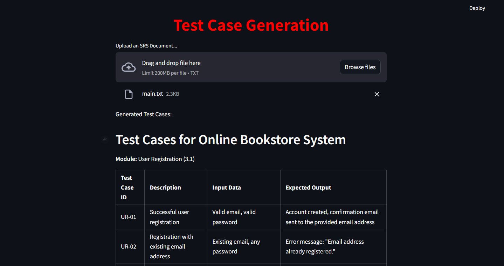
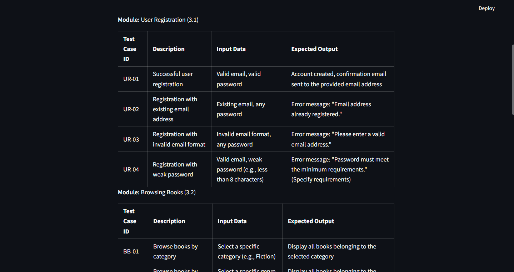

# Test Case Generation Using Retrieval-Augmented Generation (RAG)

This repository provides a solution to generate use cases from Software Requirements Specification (SRS) documents using Retrieval-Augmented Generation (RAG) and Google's Gemini API. The solution leverages LangChain for text processing and FAISS for vector storage.

## Table of Contents

- [Introduction](#introduction)
- [Requirements](#requirements)
- [Installation](#installation)
- [Usage](#usage)
- [API Endpoints](#api-endpoints)
- [Directory Structure](#directory-structure)
- [Contributing](#contributing)

## Introduction

This project aims to facilitate the automatic generation of detailed and comprehensive use cases from SRS documents. The process involves the following steps:

1. Loading and splitting SRS documents.
2. Generating embeddings for the text chunks.
3. Storing and retrieving embeddings using FAISS.
4. Using Google's Gemini API to process and generate use cases.
5. Exposing an API endpoint to upload SRS documents and receive generated use cases.

## Requirements

- Python 3.7+
- FAISS
- LangChain
- FastAPI
- Uvicorn
- Python-dotenv
- Google Generative AI API key

## Installation

1. Clone this repository:

   ```bash
   git clone https://github.com/your-repo/test-case-generation-rag.git
   cd test-case-generation-rag
   ```

2. Create a virtual environment and activate it:

   ```bash
   python -m venv env
   source env/bin/activate   # On Windows use `env\Scripts\activate`
   ```

3. Install the required dependencies:

   ```bash
   pip install -r requirements.txt
   ```

4. Set up the Google API key:

   - Create a `.env` file in the root directory of your project.
   - Add your Google API key to the `.env` file:

   ```env
   GOOGLE_API_KEY=your_google_api_key
   ```

## Usage

### Creating Vector Database

To create the vector database from the SRS documents:

1. Place your PDF documents in the `data/` directory.
2. Run the script to create the vector database:

   ```bash
   python create_vector_db.py
   ```

### Running the FastAPI Server

Start the FastAPI server to expose the API endpoint:

    ```bash
    uvicorn main:app --reload
    ```

## API Endpoints

### POST /generate_use_cases

Upload an SRS document to generate use cases.

#### Request

- `file`: The SRS document file (PDF).

#### Response

- `use_cases`: The generated use cases.

Example using `curl`:

    ```bash
    curl -X POST "http://127.0.0.1:8000/generate_use_cases" -F "file=@/path/to/your/srs_document.pdf"
    ```

## Directory Structure

    ```
    .
    ├── data/
    │   └── ...               # Directory for storing SRS PDF documents
    ├── vectorstore/
    │   └── db_faiss/         # Directory for storing FAISS vector database
    ├── .env                  # Environment variables file
    ├── create_vector_db.py   # Script to create vector database
    ├── main.py               # Main application script with FastAPI
    ├── requirements.txt      # Python dependencies
    └── README.md             # This readme file
    ```

## Contributing

Contributions are welcome! Please open an issue or submit a pull request for any changes.

This README file provides an overview of the steps and requirements to set up and run the project for generating use cases from SRS documents using Retrieval-Augmented Generation (RAG) and Google's Gemini API.

## Screenshots

- Input SRS Document => main.txt
- Output
  
  
